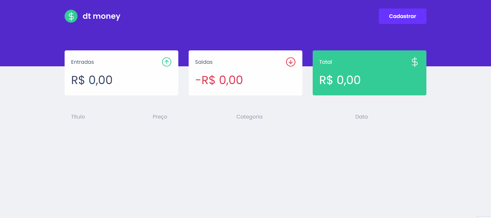

> Control your expenses

⛏ Application built to practice my React with Typescript and Styled-Components skills, the structure of the project was made using Vitejs.

### Functionalities

- You can add income and outcome money, with a title and a category. 
- Uses miragejs and axios. Doesn't have persistence of the data added.

### Working Project



### Quick Start 
Install dependencies

```
npm install
```
Run

```
npm run dev
```

This project design is from the intensive course ignite from rocketseat.